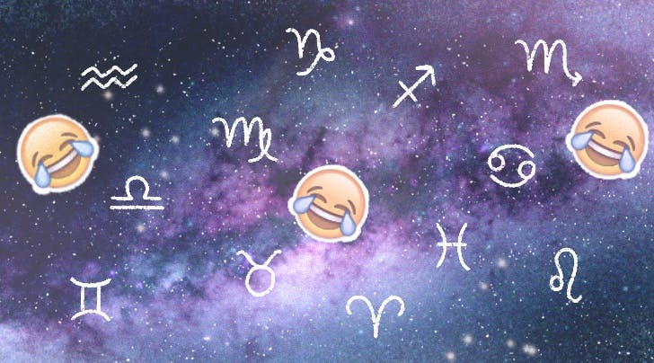
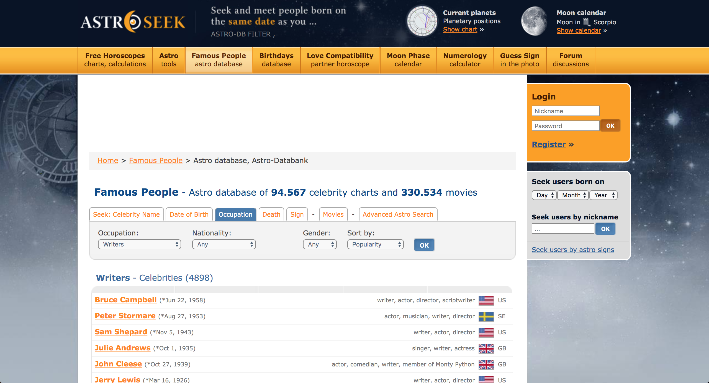
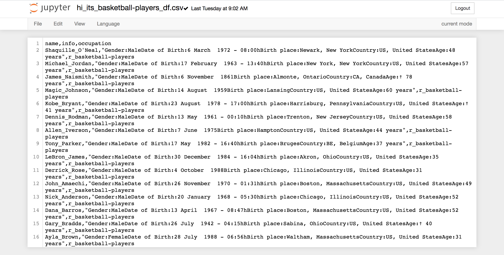
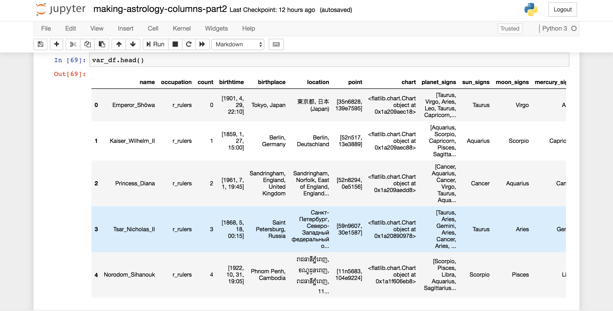
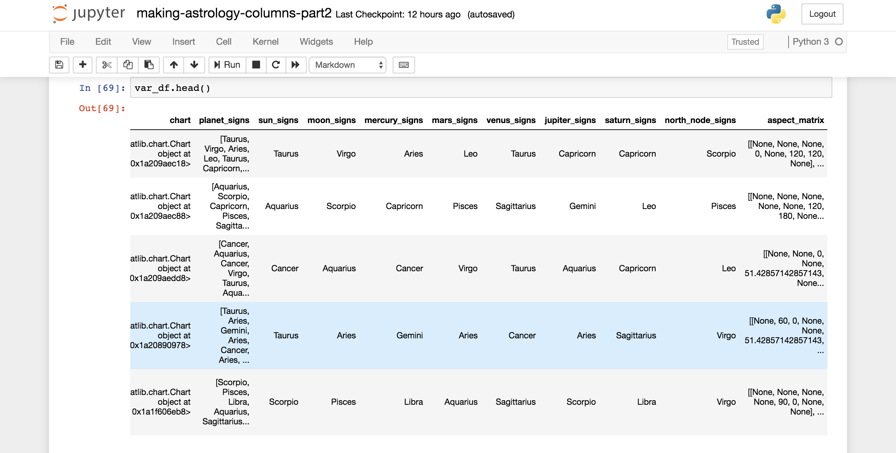
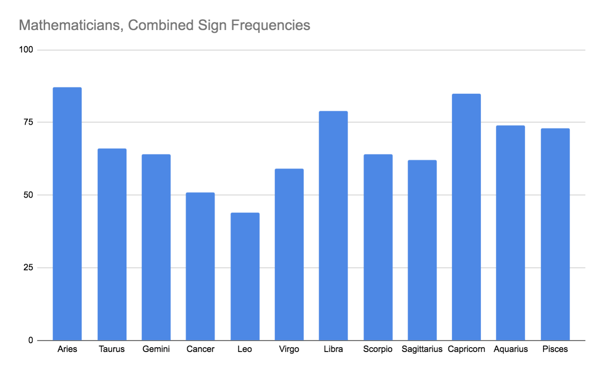
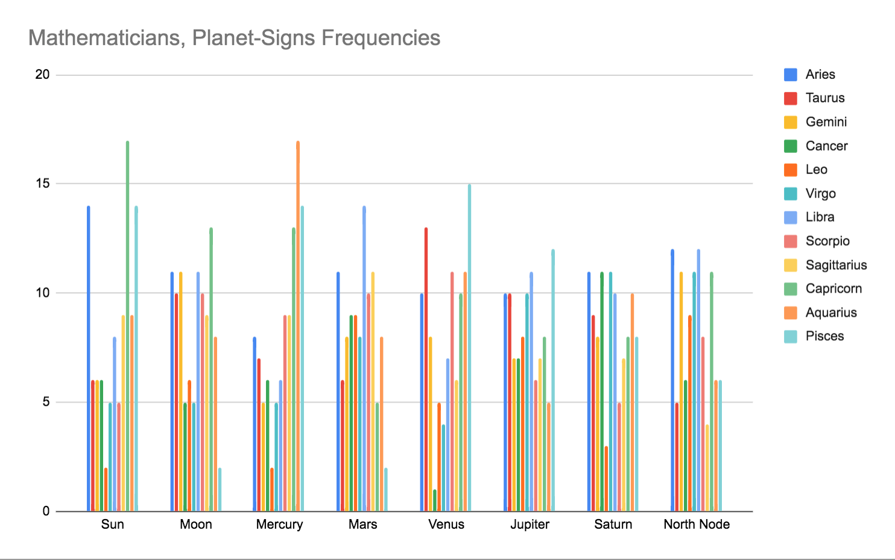
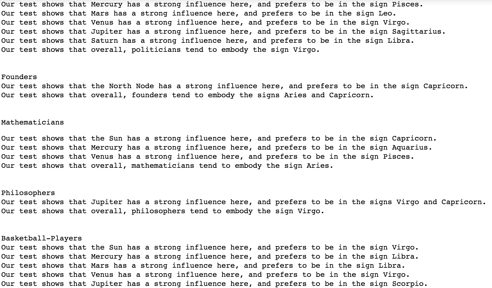

# Is There a Connection Between Astrology and Occupation?

## Section 1:

### Background

When I check out people’s stories on Instagram (as you do...), I frequently come across some phrases that strike me as unusual, phrases like ‘It’s Capricorn Seazon’ or ‘When you’re a Leo…’. For one reason or another, a sizeable portion of Instagram has become overrun by the esoteric world of astrology. I’ll frequently see someone post a screenshot of their costar astrology app, sharing their personalized mantra of the day. Considering both the prevalence of astrology on Instagram as well as the fact that a few of my friends in real-life are very much into astrology in their personal lives, I thought it would be interesting to explore astrology through the lens of data science.

I knew that I couldn’t use data science to either prove or disprove astrological claims — this is because astrological claims are not really scientifically testable, at least not without missing the point. Given this, I wanted to at least see whether there are certain astrological trends for different populations of people. I wondered whether famous activists were more likely to have a Jupiter in Libra, or whether famous cooks were more likely to have a Venus in Cancer.

### My Question

My main question is the following: Is there any significant differences in the astrological make-up of different populations of people grouped by occupation? My null hypothesis is that each occupation-group had the same distribution as the total human-population does, namely a uniform distribution among all signs. My alternate hypothesis is that one or more occupation-groups have a significantly different astrological make-up than that of the total human-population.

## Section 2:

### Getting My Data 1: Webscraping

Luckily, there are large databases of celebrities’ birthtimes and birthplaces out there on the internet. After exploring a few databases (such as astro-charts.com, astrotheme.com, cafeastrology.com and others), I found astro-seek.com to have the largest amount of data. Beyond this, astro-seek had a group of pages where the celebrities were grouped by occupation, which I found extraordinarily helpful. Once I settled on astro-seek, I began scraping my data.

Using MongoClient and BeautifulSoup, I first began scraping for the list of occupations. I got a list of 71 different occupations. For each occupation on this list, a scraped a corresponding url for a list of celebrities. This took a little bit of extra work, since there were multiple pages of urls for each occupation — I managed to solve this problem by scraping for the number of celebrities (say 4,762) for the given occupation and writing a function which transforms this number into the number of pages (24, in this case), which I then used to scrape that number (24) of celebrity-list urls. When this was completed, I had about 100,000 celebrities’ names, occupations, birthdays, and birthplaces. While I was excited to have this list, I realized that to get the actual time-of-day-of-birth for each celebrity, I would need to subsequently scrape 100,000 individual urls, one url per celebrity. This, unfortunately, was unfeasible given my time constraints. Moreover, I realized that a few of the listed occupations were things that I wasn’t all that interested in, including ‘children-of-celebrities’, ‘murderers’, ‘twins’, and other categories that are not exactly occupations. Realizing these two facts, I opted to scrape only the celebrity urls of 42 selected occupations. For example, I wanted to scrape the list of ‘baseball players’, not the list of ‘nazis’. Before long, I had a list of 42 csvs, each one containing data for a particular occupation.

### Getting My Data 2: Python Library Boogaloo

After a little bit of cleaning, my csv had the following columns: name, occupation, birthtime, and birthplace. However, my birthplace column had the names of cities (e.g. ‘San Francisco, CA, USA’), but I needed a column of latitude and longitudes (e.g. ’37.7749, 122.4194’). I need this latitude-and-longitude column because I was planning on creating a birthchart object for each celebrity, whose required arguments are birthtime (formatted as year/month/day/time) and birthplace (formatted as latitude/longitude). To find the latitudes and longitudes, I used a python library called GeoPy, which I looped over all my rows and all my dataframes. It seemed to do the job, even though it couldn’t recognize a few cities. Once GeoPy had done its work, I used a python astrology library called FlatLib to create birthchart objects for each celebrity. Finally, I was ready to create some astrology columns for my celebrities.

### Generating Astrological Attributes

My idea was to use the birthchart object I had created to generate columns of astrology attributes. My hope was that I could create the following columns:

- ‘Planet Signs’, containing each celebrity’s zodiac sign for each of their planets,

- ‘House Signs’, containing each celebrity’s zodiac sign for each of their houses,

- ‘Planetary Houses’, containing an array signifying what house each of a celebrity’s planets are in,

- ‘Aspects’, containing a list of aspects between each of a celebrity’s planets.

Unfortunately, my hopes were dashed for creating the ‘House Signs’ column and the ‘Planetary Houses’ column due to the fact that FlatLib’s house attributes were not working properly (which was slightly disappointing). Although I tried to create my own python method for creating the astrology houses (based on the Placidus house system), I needed a little bit more time to get it to work — I was close though! On the bright side, I was able to produce a ‘Planets Signs’ column and an ‘Aspects’ column (despite the fact that FlatLib was giving me a little trouble with aspects, so I had to create my own aspects method).

### Performing Statistical Tests.

At this point, I was happy to have to great columns of data (‘Planet Signs’ and ‘Aspects’). The question was how to analyze these columns. Initially, I was hoping to perform a multinomial test on my planet-signs — this would work exactly like a binomial test, except for the fact that there are 12 possible outcomes instead of usual 2, one outcome for each of the twelve zodiac signs. Using scipy, I was able to perform a multinomial probability mass function (pmf), which was exciting news — this meant that I had the probability of having the sample as an outcome given an underlying uniform distribution. However, what I really needed to calculate was a multinomial cumulative distribution function (cdf), since I was really concerned with the probability of having my sample OR samples ‘more extreme’ than my sample as an outcome given an underlying uniform distribution. Scipy doesn’t let you take the cdf of a multinomial distribution (probably because it’s very mathematically involved to specify how ‘extreme’ a point is in a 12-dimensional probability space, and whether two points are ‘extreme’ in the same way). For the moment, I was a little stuck, and I resorted to simulating points and checking whether their distance from the uniform distribution was greater or less-than my sample’s distance from the uniform distribution. This gave me some meaningful values, although they were inflated due to the fact that I was only accounting for distance and was unable to account for direction. So in effect, I had the equivalent of a two-tailed binomial test, when I really wanted just one tail. Ultimately, I decided that more time would be required to get my multinomial test to work.

Then, I tried to test my planet-signs column using a Bayesian Approach. Again, I ran into some problems due to the fact that my distribution had 12 categories — in particular, I found myself unable to use the usual Beta distribution test, which requires only two outcomes (usually something like ‘successes’ and ‘failures’). I discovered a generalization of the Beta distribution test, called the Dirichlet distribution. This test perfectly suited my data. However, I found this distribution pretty daunting, and I decided to try a simpler distribution, since time was becoming less and less of a luxury for me.

At last, I found a test that I could get to work — a chi-square goodness of fit test. I applied this test to each planet in my dataframe, as well as to the entire dataframe. I found this test very helpful, and so I decided to apply this test to all of my occupation dataframes individually. Then I plotted the results.

Since I had chosen an alpha level of 0.15, I decided to print a message for each chi-square goodness of fit test that resulted in a p-value of less than 0.15. My message contained the planet/sign matchups with the maximum frequency/frequencies. If a p-value of less than 0.15 was recorded in the case of an entire occupation and sign matchup, I just printed the sign(s) with the highest frequency/frequencies. 

The full list of my results can be found [here](occupation-data-data-science-jackson.rtf).

I was pleased with my results for my planet-signs column. Unfortunately, due to time constraints, I was unable to test my aspects column.

## Section 3:

### If I had more time…

…I would begin by testing my aspects column. Even though this is a 8x8 matrix (since I was pairing up the eight heavenly bodies I had chosen), I believe I could make a 3D bar chart to plot the frequencies of each aspect. I could probably use a chi-square goodness of fit test again here.

I would also work on creating my house method. I was about 75% there, but it’s a lot of trigonometry. If I were to have this method up and running, I get perform a chi-square goodness of fit test here in exactly the same way that I did on the planet-signs column — it’s almost a copy-and-paste situation here, since the approach is identical.

I would try to get my planetary-house column to work as well. However, the format of the data here is a little wonky, since it’s a list of 12 lists with 8 heavenly bodies spread out through it. I would have to think a little bit regarding which statistical test would be best here.

Also I was thinking I could add a numerology column. This is very simple to do, since it really only requires taking someone’s birthday mod 9 — well, it’s a little bit more complicated than just this, but it’s really not all that complicated.

### Why I Chose the Uniform Distribution as the Null Hypothesis.

Earlier, I claimed that the human-population distribution for any astrology column would be uniform. Whether it’s planet-signs, house-signs, planetary-houses, or aspects, I claimed that things should be evenly distributed. I feel like I should explain why this is the case. To begin with, if you imagine points randomly scattered through a timeline, and if you take this timeline mod n (for some n), you would find that this modded-timeline is equally distributed — this is pretty intuitive. Thus, if we assume that human births are randomly scattered throughout time and if we recognize that the zodiac signs form even cycles, we can see that human births are uniformly distributed throughout the zodiac wheel. Of course, this depend on the condition that human births are randomly scattered. Research has been done in the U.S. suggesting that there are months of the year where women are more likely to conceive a baby, hence that there are months where babies are more likely to be born. Similarly, there are certain days of the week where a baby is more likely to e born due to cultural factors. Thus, at least initially, it seems that human births are NOT uniformly distributed. However, it is my hypothesis that worldwide, these tendencies will balance out. With respect to birthmonth frequency, for instance, the seasons are flipped between the north and south hemisphere, which may even out the distribution here. Regarding days of the week, different cultures have different cultural ideal regarding weekdays, which may even out the distribution further. My hypothesis is that if we average across all geographical locations on Earth and throughout all cultures throughout all of history, births will be nearly randomly distributed throughout the zodiac wheel. Or more precisely, I am arguing that this hypothesis is a safe assumption to make — it seems to me that to assume anything other than the simplest hypothesis would be to make bold sociological claims that I have no business making (Occam teaches us this).

It’s also worth mentioning that my data includes celebrities from across the world and through time. That said, there is certainly a bias towards celebrities from America born in the 20th century. If I were to continue this project, I would investigate this and try to find some way to counterbalance it.

## Section 4:

### Conclusions.

Ultimately, my tests showed that when it comes to planet-signs, all 42 occupations have at least one planet that (likely) has a nonuniform distribution. In all, of the 378 planets (and planet-sign sums) that were tested, 200 were found to be likely nonuniform. As a percentage, this is roughly 52.91%. Thus, according to my tests, it appears that all or nearly all occupations have a significantly different astrological make-up than the human-population.

### Future ideas.

It would be interesting to make an app or something that uses my project to determine which career is best-suited astrologically for a given person. To determine this, I would compare a person’s planet-signs to each occupation distribution and output the distribution that would most likely contain the given person’s sign. I feel like this is something my astrology friends would really like, so who knows, maybe I’ll do it.
